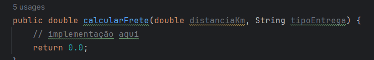
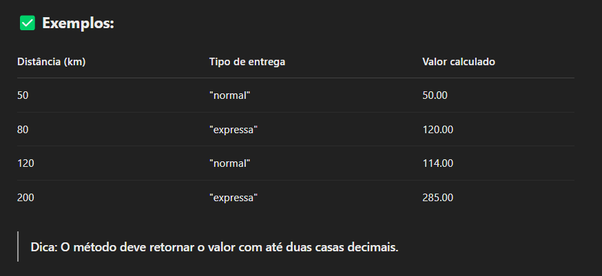
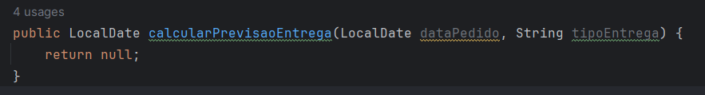
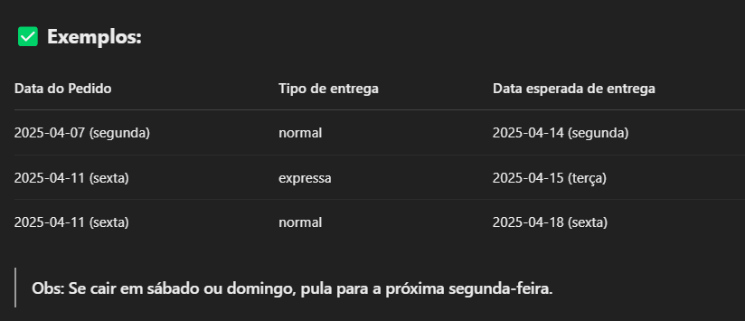
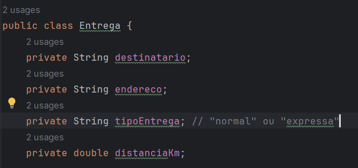
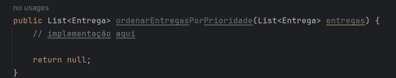
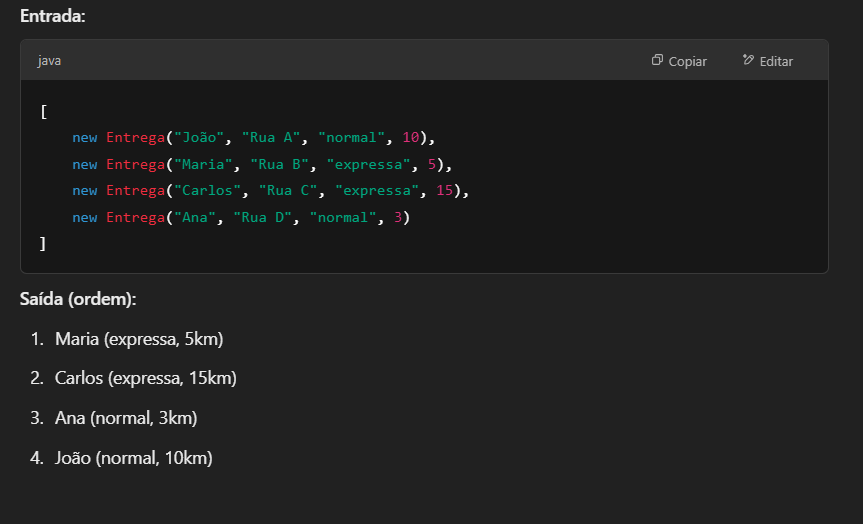
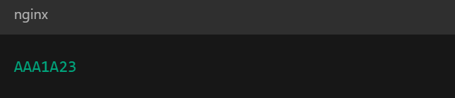
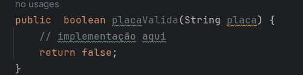

Enunciado da Questão 01:

Você deve implementar um método em Java chamado escada, que receba um parâmetro inteiro tamanho e retorne uma escada composta por espaços em branco e asteriscos (*). A escada deve ter o número de degraus correspondente ao valor de tamanho. Cada degrau deve conter um número crescente de asteriscos, começando com um asterisco no primeiro degrau e adicionando um asterisco adicional a cada degrau subsequente. A escada deve ser alinhada à direita, preenchendo o lado esquerdo com espaços em branco.

Regras:

O método deve validar que o valor de tamanho seja positivo.
Se tamanho for igual a 1, a escada deve ter apenas um asterisco.
Para valores maiores de tamanho, a escada deve ter tamanho degraus.
Cada linha da escada deve ser seguida por uma quebra de linha (\n).
Exemplo de Saída:

Para o valor tamanho = 4, a saída deve ser:

Enunciado da Questão 02:
Desafio: Calculadora de Frete por Distância

Descrição do problema:
Uma transportadora deseja automatizar o cálculo do custo de frete com base na distância da entrega e no tipo de entrega escolhida. Crie um método para calcular o valor do frete de um pedido.

Regras para o cálculo:

* O valor do frete depende da distância (em km) e do tipo de entrega.

* Existem dois tipos de entrega:

  - "normal" → R$ 1.00 por km

  - "expressa" → R$ 1.50 por km

* Se a distância for superior a 100 km, um desconto de 5% é aplicado ao valor final do frete.

* Se o tipo de entrega for inválido, uma exceção (IllegalArgumentException) deve ser lançada.

Implemente o seguinte método:

Enunciado da Questão 03:

Desafio: Previsão de Entrega

Descrição do problema:
A transportadora agora precisa informar ao cliente a data prevista de entrega com base no tipo de entrega e na data do pedido.

Você deve implementar um método que, dado o tipo de entrega e a data do pedido, calcule a data estimada de entrega conforme a tabela:

Tipo de Entrega	Prazo em dias úteis
normal	5 dias úteis
expressa	2 dias úteis

Regras:

* Fins de semana (sábado e domingo) não contam como dias úteis.

 * A data de entrega deve considerar somente dias úteis.

* Se o tipo de entrega for inválido, lançar uma exceção IllegalArgumentException.

✏️ Assinatura esperada do método:

Enunciado da Questão 04:

Desafio: Listagem de Entregas por Prioridade

Descrição do problema:

A transportadora quer organizar as entregas do dia de acordo com a prioridade de cada uma. Para isso, cada entrega possui:

* Nome do destinatário

* Endereço

* Tipo de entrega ("normal" ou "expressa")

* Distância em km

Você deve implementar um método que, dada uma lista de entregas, retorne uma nova lista ordenada por prioridade, seguindo as seguintes regras:

    1 - Entregas "expressas" vêm antes das "normais".

    2 - Dentro de cada tipo, ordenar da menor para a maior distância.

✏️ Modelo da classe Entrega:

✏️ Assinatura esperada do método:

✅ Exemplo de entrada e saída:

Enunciado da Questão 05:

Desafio: Validador de Placa de Veículo
Descrição do problema:
O sistema da transportadora precisa validar o formato das placas de veículos utilizados nas entregas. No Brasil, desde 2018, está em uso o formato Mercosul, que segue o padrão:

Onde:

- A → letra maiúscula (A-Z)

- 1 e 23 → números (0-9)

Você deve criar um método que valide se uma string representa uma placa válida no formato Mercosul.

✏️ Assinatura esperada do método:

✅ Exemplos de placas válidas:

- ABC1D23

- QWE9Z87

❌ Exemplos inválidos:

- AB123CD (letras e números fora da ordem)

- abc1d23 (letras minúsculas)

- ABCD123 (letras a mais)

- ABC1234 (formato antigo)