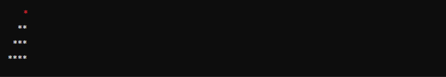

Enunciado da Questão 01:

Você deve implementar um método em Java chamado escada, que receba um parâmetro inteiro tamanho e retorne uma escada composta por espaços em branco e asteriscos (*). A escada deve ter o número de degraus correspondente ao valor de tamanho. Cada degrau deve conter um número crescente de asteriscos, começando com um asterisco no primeiro degrau e adicionando um asterisco adicional a cada degrau subsequente. A escada deve ser alinhada à direita, preenchendo o lado esquerdo com espaços em branco.

Regras:

O método deve validar que o valor de tamanho seja positivo.
Se tamanho for igual a 1, a escada deve ter apenas um asterisco.
Para valores maiores de tamanho, a escada deve ter tamanho degraus.
Cada linha da escada deve ser seguida por uma quebra de linha (\n).
Exemplo de Saída:

Para o valor tamanho = 4, a saída deve ser:

